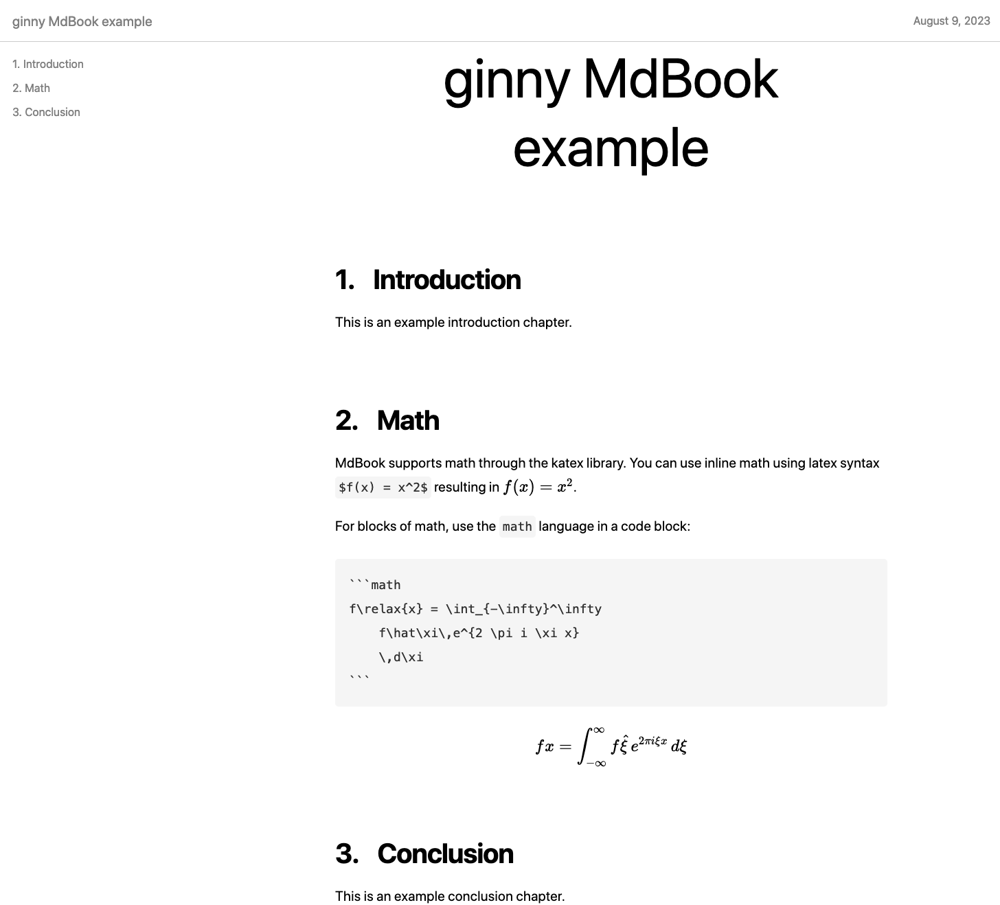

# ginny \<MdBook/\>

A [ginny](https://github.com/jessevdk/ginny) component for creating a single page HTML book from markdown files.



_MdBook HTML result of the [example](./example/)._

## Concept

The idea of MdBook is to take a set of markdown files that are usable on their own and render them in a single page book form that is easy to consume and search. It relies on a small number of conventions to extract the title and chapter information out of regular markdown files.

### Conventions

1. (ginny) the site entry point is specified in the package.json `main` field.
2. The tsx entry point (typically `index.tsx`) instantiates single `MdBook` component passing it the ginny `context` (see [example/src/index.tsx](./example/src/index.tsx)).
3. The book title and list of markdown files are by default read from a `README.md` file living next to the `tsx` entry point file (see [Component API](#component-api) for details).
   1. The first-level heading of the index (i.e. `README.md`) file will become the book title
   2. Any markdown file linked from the main index (i.e. `README.md`) is included in the book
   3. Any first-level heading in linked markdown files becomes a chapter

## Markdown support

MdBook uses the [marked](https://github.com/markedjs/marked) markdown library to parse and format markdown files. Additional features on top of regular marked support:

- `mermaid`: [mermaid](https://mermaid.js.org/) diagrams are support using a code block tagged with the `mermaid` language
- If images have a specified title (specified as a quoted text after the image file reference), then this image is rendered as a `<figure>` with a `<figcaption>`.

## Install

In an existing ginny project:

```bash
npm install -s ginny-mdbook
```

## Usage

Once you have a ginny project setup to use MdBook, simply use `npx ginny` to generate the single page book.

## Component API

### MdBook component

#### context property
The context property contains the ginny `Context` instance, used to derive page context information

#### index property
This optional property can specify the markdown index file (by default this is `README.md`) or a user specified object containing an explicit title and list of markdown files to include. Typically reading the index from a markdown file is better because it keeps all the necessary information directly in markdown.

### Example

```tsx
import { PageContext } from "ginny";
import MdBook from "ginny-mdbook";

export default (context: PageContext) => <MdBook context={context} />;
```
